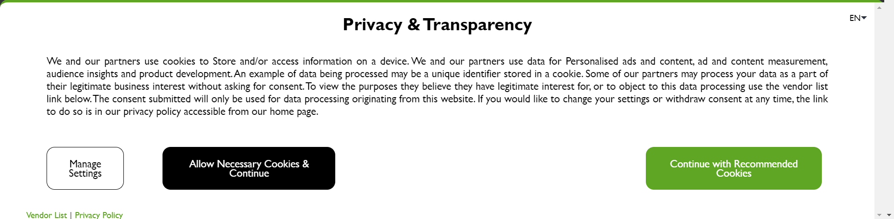
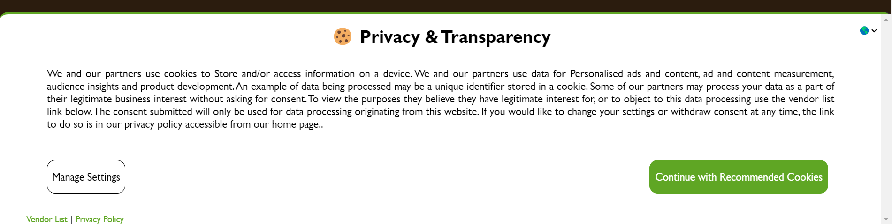

# Ez Privacy Denier

You may have noticed when browsing the web that your data is sold to hundreds and hundreds of vendors when you click "Accept all cookies", which can be the instinctual thing to do for many. One cookie prompt that I see often is this one (see [this website](https://www.ezoic.com/)): 

This banner is fine as you are easily able to only accept necessary cookies using the black button, however on some sites [like this one](https://www.appsloveworld.com/csharp/100/236/xslloadexception-resolving-of-external-uris-was-prohibited), that button is nowhere to be seen:

This extension will automatically open the consent settings when it detects that there is a cookie banner on the page and uncheck all of the cookie consent checkboxes, then save your preferences.

## Demo of auto denier working (gif)

